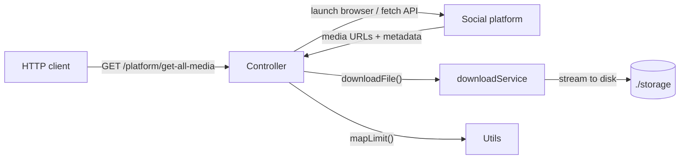

SMF is structured as three distinct layers. Each layer has a single responsibility, and dependencies flow strictly downward — controllers use services and utils, but services and utils have no knowledge of controllers.

## Layers

<Columns cols={3}>
  <Card title="Controllers" icon="route">
    Per-platform logic. Each controller handles one social media platform: navigating to the right URLs, intercepting network responses or scraping the DOM, and collecting media URLs. Controllers call services and utils but contain no download or I/O logic themselves.
  </Card>
  <Card title="Services" icon="gears">
    Shared, platform-agnostic functionality. The download service handles all file I/O using Node.js streams and pipelines. The DeviantArt-specific services handle Puppeteer auth and gallery pagination for that platform.
  </Card>
  <Card title="Utils" icon="wrench">
    Low-level utilities with no side effects. Includes the bounded concurrency pool (`mapLimit`), human behavior simulation (`moveMouseInCircle`, `injectVisualCursor`), and filename sanitization (`sanitizeFilename`).
  </Card>
</Columns>

## Request flow

## Controllers

There is one controller file per platform. Each exports a single route handler (`getAllMedia` or `startOFScraper`) that is registered directly in `app.js`.

| Controller | Route | Engine type |
|---|---|---|
| `deviantartController.js` | `/deviantart/get-all-media` | Puppeteer (hybrid — falls back to REST with valid auth) |
| `instagramController.js` | `/instagram/get-all-media` | Puppeteer |
| `onlyfansController.js` | `/onlyfans/get-all-media` | Puppeteer (persistent profile) |
| `threadsController.js` | `/threads/get-all-media` | Puppeteer |
| `tiktokController.js` | `/tiktok/get-all-media` | Puppeteer |
| `xController.js` | `/x/get-all-media` | Puppeteer |
| `pinterestController.js` | `/pinterest/get-all-media` | REST |
| `pixivController.js` | `/pixiv/get-all-media` | REST |

See [Engine types](/architecture/engines) for a detailed explanation of the difference between Puppeteer and REST engines.

## Services

| Service | File | Description |
|---|---|---|
| `downloadService` | `services/downloadService.js` | Universal file downloader. Uses `axios` in streaming mode and Node's `pipeline` from `stream/promises` to write directly to disk without buffering the full file in memory. Skips files that already exist. |
| `daAuthService` | `services/daAuthService.js` | Puppeteer-based DeviantArt authenticator. Launches a headless browser, injects PerimeterX and auth cookies, intercepts network traffic to capture a live `csrf_token`, scrapes profile metadata from the DOM, and verifies the session against DeviantArt's internal API. |
| `daGalleryService` | `services/daGalleryService.js` | DeviantArt gallery paginator. Provides two strategies: authenticated API access using DeviantArt's internal `_puppy` endpoints, and guest-mode HTML scraping using Puppeteer when no valid session is available. |

## Utils

All utilities live in `utils/utils.js` and are stateless pure functions (or near-pure async functions).

| Utility | Description |
|---|---|
| `mapLimit(items, limit, fn)` | Bounded promise pool. Runs `fn` on each item in `items` with at most `limit` concurrent executions. See [Concurrency model](/architecture/concurrency). |
| `moveMouseInCircle(page)` | Moves the Puppeteer mouse in a randomized, slightly imperfect circle to simulate human cursor movement and pass behavioral bot-detection checks. |
| `injectVisualCursor(page)` | Injects a visible red CSS cursor overlay into the page for debugging Puppeteer sessions. |
| `sanitizeFilename(text, limit)` | Strips HTML tags, forbidden filesystem characters (`\/:*?"` and angle brackets/pipe), and control characters from a string. Truncates to `limit` characters (default 25). Guards against Windows reserved names (`CON`, `NUL`, etc.). |
